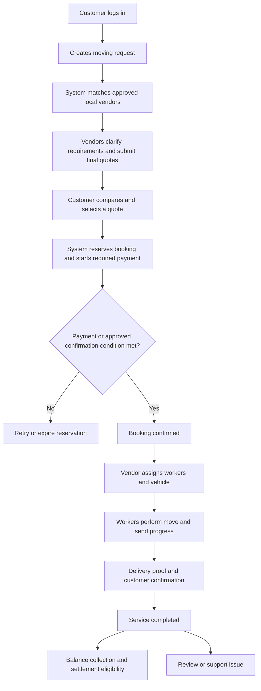

# 2. Functional Requirements and Process Flows

## 2.1 End-to-end service flow

Settlement is conditional on payment and dispute checks. Completion alone does not authorize money movement.

## 2.2 Customer requirements

| ID | Requirement | Expected behavior |
|---|---|---|
| C01 | Register/login | Verify phone OTP; show retry limits and expiry; preserve draft where safe |
| C02 | Manage profile | Update name, language, own addresses and notification preferences |
| C03 | Create request | Save a draft; validate location, future date/time, required services and access fields |
| C04 | Submit request | Show serviceability result; create one request despite repeated taps |
| C05 | Manage request | View matching progress; edit an unbooked request with revision tracking; close request |
| C06 | Compare quotes | Show vendor, verified-review summary, total, inclusions, exclusions, validity and time window |
| C07 | Accept quote | Revalidate availability and quote revision; show terms before acceptance |
| C08 | Pay | Start/retry checkout; display backend-confirmed status and receipt/reference |
| C09 | View booking | Show agreed scope, vendor, time, assigned team when available and event timeline |
| C10 | Approve extra work | Review itemized change order and revised amount before approving or rejecting |
| C11 | Cancel/reschedule | Show applicable policy and estimated financial effect; confirmed-date changes need vendor acceptance |
| C12 | Confirm delivery | Confirm using delivery code or approved fallback; report missing/damaged items separately |
| C13 | Get support | Open a ticket linked to request/booking; attach evidence and follow responses |
| C14 | Review | One customer review per completed booking; edit within configured rules |

Rescheduling keeps the old confirmed date until both parties accept the new schedule and any pricing change. Assignment availability must be rechecked before committing it.

## 2.3 Vendor requirements

| ID | Requirement | Expected behavior |
|---|---|---|
| V01 | Apply | Submit business/contact information, areas, services, and required documents |
| V02 | Track approval | View pending, changes requested, approved, rejected or suspended status and reasons |
| V03 | Manage offering | Configure service areas, available services, vehicle records and operational availability |
| V04 | View eligible leads | Show authorized request details; accept interest, decline, or ask scoped clarification |
| V05 | Quote | Draft and submit itemized final quote or request survey; show validity and assumptions |
| V06 | Revise/withdraw quote | New revision before acceptance; accepted quote cannot be overwritten |
| V07 | Manage bookings | View own confirmed bookings, schedules, policy snapshots and operational alerts |
| V08 | Manage workforce | Invite workers, deactivate membership, and see invitation/acceptance status |
| V09 | Assign team | Assign available workers and vehicle, appoint lead worker, handle rejection and reassignment |
| V10 | Propose changes | Submit reason and itemized change order for customer approval |
| V11 | Handle exceptions | Report delays, breakdowns, no-shows, damage and service interruption |
| V12 | View finances | View own collected amounts, pending balances, commission, refunds and settlement statements |

The vendor portal must identify overdue quotes, unassigned upcoming jobs, rejected assignments, and pending customer approvals. Vendor employees should not automatically receive owner-level finance permissions.

## 2.4 Worker requirements

| ID | Requirement | Expected behavior |
|---|---|---|
| W01 | Activate account | Verify identity channel and accept a legitimate vendor invitation |
| W02 | View assignments | See own upcoming/current jobs; customer details limited to operational need |
| W03 | Accept/reject | Confirm assignment or provide a rejection reason, notifying the vendor |
| W04 | Execute job | Lead worker advances permitted milestones; other workers can submit notes/proof |
| W05 | Add evidence | Upload item/checklist photos with authorization and timestamps |
| W06 | Report issue | Record description and evidence; alert vendor and support where necessary |
| W07 | Complete delivery | Submit proof and customer confirmation; never read a stored plaintext delivery code |
| W08 | Work with poor connectivity | Preserve drafts and queued uploads; show unsynced state and reconcile safely |

Offline progress is provisional. The server may reject a stale or out-of-order transition and must return the current authoritative state.

## 2.5 Admin requirements

| ID | Requirement | Expected behavior |
|---|---|---|
| A01 | Secure access | Restricted admin accounts and stronger authentication; no public admin registration |
| A02 | Vendor review | Inspect submitted documents, request changes, approve/reject with reasons and audit history |
| A03 | Marketplace configuration | Manage areas, services, policy versions and approved commercial settings |
| A04 | Booking oversight | Search by reference, date, status, vendor and customer; inspect event history |
| A05 | Customer support | Triage tickets, document actions, resolve disputes and communicate decisions |
| A06 | Financial operations | Inspect reconciliation, approve authorized adjustments, track refunds and settlements |
| A07 | Account moderation | Suspend access with reasons; route impacted live bookings to operations |
| A08 | Reviews | Moderate abusive content with reason and history; do not fabricate ratings |
| A09 | Reporting | Show marketplace activity and financial totals with clear definitions |
| A10 | Audit | Record sensitive reads/actions, state overrides, permission changes and finance actions |

Separate support, verification, and finance permissions even if a small pilot initially has one admin operator. Manual overrides must use validated commands with reasons, not unrestricted database editing.

## 2.6 Role access matrix

| Resource/action | Customer | Vendor | Worker | Admin |
|---|---|---|---|---|
| Request details | Own | Eligible limited view | Assigned booking details only | Authorized operational access |
| Submit quote | No | Own vendor only | No | No; can moderate |
| Accept quote/pay | Own | No | No | Can assist through audited support, not impersonate payment |
| Booking details | Own | Own vendor | Assigned only | Authorized operational access |
| Assign workers/vehicle | No | Own vendor | No | Audited operational override |
| Advance job status | Confirm delivery | Allowed supervisor fallback | Assigned lead worker | Audited override |
| Finance | Own charges/refunds | Own vendor | No | Finance permission |
| Vendor approval | No | View own result | No | Verification permission |

## 2.7 State machines

Maintain separate request, quote, booking, assignment, payment, refund, and settlement states. A single status field cannot safely describe all of them.

### Moving request

`DRAFT → OPEN → RESERVED → BOOKED`

- `DRAFT → CLOSED` if discarded.
- `OPEN → CLOSED` if cancelled before selection.
- `OPEN → EXPIRED` after the configured request expiry.
- `RESERVED → OPEN` if payment fails/expires and the request remains valid.
- `RESERVED → BOOKED` only after booking confirmation succeeds.
- A booked request stays linked to its booking even if that booking is later cancelled. A retry with another vendor uses an explicit new/reopened request workflow with history and customer approval.

### Quote

`DRAFT → SUBMITTED → ACCEPTED`

- `SUBMITTED → WITHDRAWN`, `EXPIRED`, `SUPERSEDED`, or `NOT_SELECTED`.
- Selection temporarily reserves the submitted quote via the booking reservation.
- Confirmation changes the chosen quote to `ACCEPTED` and other current quotes to `NOT_SELECTED`.
- Reservation expiry releases the quote only if still valid and unchanged; otherwise it expires.

### Booking/service

| Current state | Next state | Authorized actor and condition |
|---|---|---|
| PENDING_PAYMENT | CONFIRMED | System; verified required payment or configured no-advance policy |
| PENDING_PAYMENT | EXPIRED | System; reservation timeout, reconciled against payment events |
| CONFIRMED | ASSIGNED | Vendor; valid team and vehicle attached |
| ASSIGNED | EN_ROUTE_PICKUP | Lead worker; accepted assignment and service window |
| EN_ROUTE_PICKUP | ARRIVED_PICKUP | Lead worker; arrival recorded |
| ARRIVED_PICKUP | PACKING | Lead worker; packing included |
| ARRIVED_PICKUP/PACKING | LOADING | Lead worker; required packing complete or legitimately omitted |
| LOADING | IN_TRANSIT | Lead worker; loading checklist complete |
| IN_TRANSIT | ARRIVED_DROPOFF | Lead worker |
| ARRIVED_DROPOFF | UNLOADING | Lead worker |
| UNLOADING | AWAITING_CONFIRMATION | Lead worker; included unpacking/assembly checklist and proof complete |
| AWAITING_CONFIRMATION | COMPLETED | Customer confirmation; admin fallback requires documented evidence |
| CONFIRMED/ASSIGNED/EN_ROUTE_PICKUP | CANCELLED | Authorized cancellation policy evaluation |

`PENDING_PAYMENT` can also become `CANCELLED` by customer action. After arrival/work starts, admin-managed service termination may move the booking to `TERMINATED` with recorded performed work and a financial decision. Do not mark incomplete service as completed.

An issue/dispute is a linked record and may coexist with a booking state. A delay does not automatically reset the service timeline. Reassignment invalidates old worker permissions; if it leaves no accepted team before departure, return `ASSIGNED` to `CONFIRMED` through an audited reassignment command.

### Assignment

`PROPOSED → ACCEPTED` or `REJECTED`; an active assignment may become `REPLACED` or `CANCELLED`. Booking assignment status and individual acceptance must be visible separately.

### Finance

- Payment attempt: `CREATED → PENDING → SUCCEEDED | FAILED | EXPIRED`.
- A late provider success can correct an expired attempt through reconciliation; whether to confirm a booking or refund depends on reservation ownership.
- Refund: `REQUESTED → APPROVED | REJECTED`; approved refunds become `PROCESSING → SUCCEEDED | FAILED`.
- Settlement: `NOT_ELIGIBLE → ON_HOLD | ELIGIBLE → PROCESSING → PAID | FAILED`.
- Partial/full refunded totals are derived from successful refund records. Do not overwrite a successful payment with a generic “refunded” flag and lose its history.

## 2.8 Detailed workflows and exceptions

### Vendor onboarding

1. Vendor registers and submits an application.
2. Server validates required data and stores documents privately.
3. Admin reviews and approves, rejects, or requests corrections with reasons.
4. Vendor receives a notification and can inspect the decision.
5. Approved vendor configures services and workforce and becomes eligible for matching.
6. Material identity/document changes create a new review where required by policy.

### Request matching and no quotes

1. Validate pickup/destination serviceability and requested date.
2. Select approved vendors whose service areas and supported services fit the move.
3. Issue lead invitations to a configurable number of eligible vendors; record delivery status.
4. Keep the request `OPEN` while waiting, show a realistic response deadline, and notify on new quotes.
5. If no vendors or quotes are available, show that explicitly. Offer editing date/details or support. Do not create a booking or fabricate estimates.

### Quote acceptance and payment

1. Customer chooses a valid final quote and reviews its full scope and policy.
2. Backend atomically checks request revision, vendor eligibility, quote validity, and absence of another active booking reservation.
3. Create a booking reservation and payment order using an idempotency key.
4. Customer completes provider checkout. App redirect alone is insufficient evidence of success.
5. Backend verifies provider webhook/status and atomically confirms the reservation.
6. Notify customer/vendor, close competing quotes, and create an assignment task.
7. If payment succeeds after expiry, reconcile availability and customer authorization. If confirmation is unsafe, refund/review the payment; never allocate two bookings.

### Move execution and delivery

1. Vendor assigns workers and vehicle; workers accept.
2. Lead worker sees permitted contact/address data and travels to pickup.
3. Record arrival, packing if included, loading checklist, transit, arrival at destination, and unloading.
4. For extra scope, pause the affected additional work and request customer-approved change order.
5. Submit delivery proof and request customer confirmation.
6. Customer confirms using a short-lived code or in-app confirmation.
7. If the customer is unavailable, support reviews evidence under an approved fallback process. No automatic completion merely because time elapsed in the proposed MVP.
8. Record completion and initiate balance/settlement checks independently.

### Refund and settlement

1. Evaluate cancellation/dispute against the booked policy and performed work.
2. Authorized operator or deterministic policy approves a specific refund amount.
3. Server prevents refunding more than the available refundable amount, including in-flight refunds.
4. Submit refund through provider and await confirmed outcome.
5. Settlement eligibility checks successful collections, approved adjustments, commission, dispute holds, and previous settlements.
6. Record payout reference and confirm outcome through the supported provider or an audited manual bank-transfer reconciliation process.
7. A dispute after settlement follows a documented recovery/adjustment process; never silently edit a paid settlement.

## 2.9 Notifications

| Event | Recipients | Channels |
|---|---|---|
| Login challenge | Account owner | OTP channel |
| Vendor approval/correction | Vendor | Portal inbox; optional email/push |
| New eligible request | Vendor | Portal inbox; selected alert channel |
| Quote submitted/expiring | Customer | In-app and push |
| Booking/payment confirmed | Customer and vendor | In-app; receipt through selected channel |
| Assignment/new schedule | Assigned worker | In-app and push |
| Assignment rejected | Vendor | Portal inbox and alert |
| Job milestones/delay | Customer and vendor | In-app and selected push events |
| Change order | Customer | In-app and push |
| Cancellation/refund/dispute decision | Relevant participants | In-app and selected transactional channel |
| Unassigned job/provider failure | Authorized operations team | Admin alert |

Notifications are retried asynchronously and deduplicated. The product timeline remains available if push/SMS fails. Lock-screen messages should not expose full addresses or sensitive evidence.
