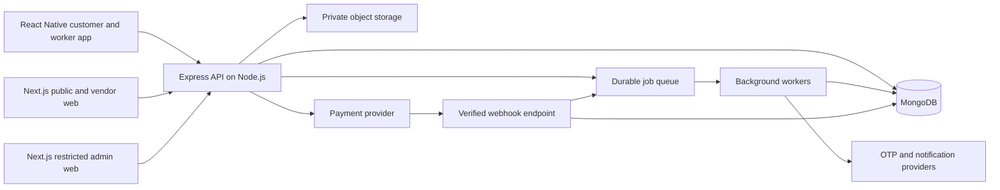

# 3. Architecture, Data Model, and API Specification

This document specifies the intended implementation. It is not application code. Package versions, hosting vendors, and provider SDKs will be selected and verified during development.

## 3.1 Proposed architecture



Next.js provides React-based web interfaces. React Native provides mobile interfaces. Express is the authoritative business API running on Node.js. MongoDB stores operational records. File content belongs in private object storage, not in ordinary MongoDB booking documents.

Use a modular monolith first: one backend codebase with clearly separated modules and an independently runnable background worker. Microservices are unnecessary for the initial scope.

Recommended implementation language: TypeScript across web, mobile, and server. Share contracts and validation definitions where practical, while keeping backend authorization authoritative.

## 3.2 Proposed repository structure

```text
apps/
  web/                 # Public website and vendor portal, Next.js
  admin/               # Restricted admin interface, Next.js
  mobile/              # Customer and worker navigation, React Native
  api/                 # Express HTTP API and business modules
  jobs/                # Queue processing and scheduled reconciliation
packages/
  contracts/           # API types, enums, shared validation contracts
  config/              # Shared lint/TypeScript configuration
  domain/              # Server-only domain logic shared by API and jobs
docs/                  # Requirements, architecture, API and decision records
infra/                 # Deployment definitions when hosting is chosen
```

Do not place server secrets or server-only modules in shared client packages. Using separate admin deployment helps restrict access but does not replace authorization.

## 3.3 Backend modules

| Module | Responsibility |
|---|---|
| Authentication | OTP, sessions, token rotation, logout and recovery |
| Accounts and memberships | Profiles, roles, vendor membership and invitations |
| Vendor verification | Applications, document review and approval lifecycle |
| Catalog and serviceability | Areas, services, eligibility rules |
| Moving requests | Drafts, revisions, inventory and lead invitations |
| Quotes | Itemized prices, revisions, expiry and acceptance validation |
| Bookings | Reservations, policy snapshots and lifecycle commands |
| Dispatch | Workers, vehicles, assignments and availability checks |
| Job execution | Milestones, checklists, delivery confirmation and evidence |
| Finance | Payment attempts, refunds, commission and settlement ledger |
| Support | Tickets, disputes, decisions and escalation |
| Communication | Notification inbox, device tokens and asynchronous delivery |
| Administration | Configuration, audit access and reports |

## 3.4 Data model

All primary records use a stable ID, `createdAt`, and `updatedAt`. Use UTC timestamps and store the service time zone separately for customer-facing scheduling. Mutable workflow records carry a `version` for concurrency checks. Store money as integer minor units with an explicit currency; never use floating-point arithmetic for financial amounts.

| Collection | Main fields and relationships |
|---|---|
| users | normalized phone, displayName, language, accountStatus, verifiedAt |
| sessions | userId, hashed refresh token/session reference, expiry, revokedAt, device metadata |
| otpChallenges | destination reference, hashed code, expiry, attempt count, consumedAt |
| vendorMemberships | vendorId, userId, role, status, invitation/acceptance metadata |
| vendorApplications | applicantId, business details, document file IDs, review state and reasons |
| vendors | ownerId, businessName, status, serviceAreaIds, serviceIds, verification summary |
| serviceAreas | locality definitions or supported geographic geometry, status, timeZone |
| services | service code, label, description, supported checklist configuration |
| addresses | userId, label, address fields, coordinates; booking/request uses a snapshot |
| movingRequests | customerId, pickup/destination snapshots, schedule window, services, item list, file IDs, revision, status |
| leadInvitations | requestId, vendorId, requestRevision, response state, delivery timestamps |
| quotes | requestId, vendorId, requestRevision, quoteRevision, itemized lines, currency, total, assumptions, expiry, status |
| bookings | requestId, customerId, vendorId, quoteId, immutable quote/policy snapshots, schedule, state, version, reservationExpiry |
| vehicles | vendorId, identifier, type, capacity description, availability/status |
| assignments | bookingId, vendorId, workerUserIds, leadWorkerId, vehicleId, reserved interval, acceptance states, version |
| bookingEvents | bookingId, sequence/version, actorId, old/new state, eventType, timestamp, evidence references |
| changeOrders | bookingId, proposedBy, lines, priceDelta, schedule impact, status, customer decision and timestamp |
| paymentAttempts | bookingId, purpose, amount, currency, provider/order/payment IDs, idempotency reference, status |
| refunds | bookingId, paymentAttemptId, amount, reason, approval metadata, providerRefundId, status |
| ledgerEntries | bookingId, vendorId, entryType, signed amount, currency, source record, posting group, timestamp |
| settlements | vendorId, included ledger references, amount, currency, status, payout reference |
| supportTickets | openedBy, bookingId/requestId, category, messages/evidence, assignee, state |
| disputes | bookingId, ticketId, requested remedy, evidence, decision, settlement hold, resolution metadata |
| reviews | bookingId, customerId, vendorId, rating, text, moderation status |
| files | ownerId, vendorId/bookingId scope, objectKey, contentType, size, scan status, purpose |
| notifications | recipientId, eventId, template, safe payload, channel status, readAt |
| deviceTokens | userId, deviceId, push token, active status |
| policyVersions | policy type, immutable version, effective date, configured values |
| auditLogs | actorId, permission context, target, action, safe before/after fields, reason, requestId |
| webhookEvents | provider, eventId, verified timestamp, processing status, safe payload reference |
| outboxEvents | transaction-linked event, processing state, retry count, nextAttemptAt |
| idempotencyRecords | actor/scope, key, request fingerprint, result reference, expiry |

The precise schema can split large item lists, messages, or event histories into child collections. Avoid unbounded arrays in frequently updated documents.

### Key relationships

- Customer → many moving requests.
- Moving request → many vendor quotes; at most one active reservation/booking at a time.
- Confirmed booking → one selected vendor and immutable accepted scope.
- Vendor → many memberships, vehicles, quotes, and bookings.
- Booking → assignment history, events, change orders, payment attempts, refunds, and support records.
- Completed booking → at most one customer review.

### Indexes and constraints

- Unique normalized phone on active account identities under the chosen account-reuse policy.
- Unique vendor/user membership pair; conditional rule if only one active worker membership is allowed.
- Unique quote revision for `(requestId, vendorId, quoteRevision)`.
- Atomic request reservation field plus a unique partial active-booking constraint on `requestId`.
- Unique provider payment ID, refund ID, and `(provider, eventId)` webhook identifier.
- Unique review `bookingId` and idempotency `(actor/scope, key)`.
- Compound query indexes for customer bookings, vendor schedule, assigned-worker jobs, open leads, and support queues.
- Geospatial index only where actual matching uses stored valid geometry.
- Expiry indexes may clean OTP/session data. Business reservation/quote expiry still requires explicit checks and a job; cleanup timing is not a booking correctness mechanism.

Interval conflicts cannot be prevented by a simple unique index. Assignment writes need a concurrency-safe reservation strategy, such as locked resource calendars or transactional slot reservations, including travel/setup buffers. Validate it under concurrent tests.

## 3.5 API conventions

- Base path: `/api/v1`.
- Authenticated identity comes from the verified session/token, never a client-submitted `customerId` or `vendorId` alone.
- Resource authorization checks role, membership, tenant ownership, assignment, and current state.
- Lists use cursor pagination and server-enforced limits.
- Mutating commands return the updated resource/version or an explicit async operation reference.
- Use `400` for malformed input, `401` for missing/invalid authentication, `403` for forbidden actions, `404` where appropriate to avoid resource enumeration, `409` for state/version conflicts, `422` for semantic validation, and `429` for limits.
- Error contract: `{ error: { code, message, fieldErrors? }, requestId }`.
- Require idempotency keys for booking creation, payment/refund requests, and other retry-sensitive commands.
- For version-sensitive changes send `expectedVersion`; reject stale writes with the current safe resource state.
- Publish an OpenAPI specification during implementation and use it for client contract validation.

## 3.6 Proposed API inventory

Names are a starting contract; implementation should finalize payloads and permissions before client development.

| Group | Endpoints |
|---|---|
| Auth | `POST /auth/otp/request`, `POST /auth/otp/verify`, `POST /auth/refresh`, `POST /auth/logout` |
| Account | `GET /me`, `PATCH /me`, `GET/POST /me/addresses`, `PATCH/DELETE /me/addresses/:id`, `POST /me/device-tokens` |
| Catalog | `GET /services`, `GET /service-areas`, `POST /serviceability/check` |
| Vendors | `POST /vendor-applications`, `GET/PATCH /vendor-applications/:id`, `POST /vendor-applications/:id/submit`, `GET/PATCH /vendor/profile` |
| Workforce | `GET /vendor/workers`, `POST /vendor/worker-invitations`, `POST /worker-invitations/:id/accept`, `PATCH /vendor/workers/:id/membership` |
| Vehicles | `GET/POST /vendor/vehicles`, `PATCH /vendor/vehicles/:id` |
| Requests | `POST /moving-requests`, `GET /moving-requests`, `GET/PATCH /moving-requests/:id`, `POST /moving-requests/:id/submit`, `POST /moving-requests/:id/close` |
| Vendor leads | `GET /vendor/leads`, `POST /vendor/leads/:id/decline`, `POST /vendor/leads/:id/clarifications`, `POST /vendor/leads/:id/survey-requests` |
| Quotes | `POST /moving-requests/:id/quotes`, `GET /moving-requests/:id/quotes`, `PATCH /quotes/:id`, `POST /quotes/:id/submit`, `POST /quotes/:id/withdraw` |
| Booking | `POST /bookings` with quote ID/version, `GET /bookings`, `GET /bookings/:id`, `GET /bookings/:id/events` |
| Changes | `POST /bookings/:id/cancellation-preview`, `POST /bookings/:id/cancel`, `POST /bookings/:id/reschedule-requests`, `POST /reschedule-requests/:id/decision` |
| Dispatch | `POST /bookings/:id/assignments`, `POST /assignments/:id/accept`, `POST /assignments/:id/reject`, `GET /worker/jobs` |
| Execution | `POST /bookings/:id/transitions`, `POST /bookings/:id/evidence`, `POST /bookings/:id/issues` |
| Completion | `POST /bookings/:id/delivery-challenge`, `POST /bookings/:id/confirm-delivery` |
| Change orders | `POST /bookings/:id/change-orders`, `POST /change-orders/:id/approve`, `POST /change-orders/:id/reject` |
| Payments | `POST /bookings/:id/payment-orders`, `GET /bookings/:id/payments`, `POST /webhooks/payments/:provider` |
| Support | `POST /support-tickets`, `GET /support-tickets`, `GET /support-tickets/:id`, `POST /support-tickets/:id/messages` |
| Reviews | `POST /bookings/:id/review`, `GET /vendors/:id/reviews` |
| Files | `POST /files/upload-intents`, `POST /files/:id/finalize`, `GET /files/:id/access` |
| Notifications | `GET /notifications`, `POST /notifications/:id/read` |
| Admin verification | `GET /admin/vendor-applications`, `POST /admin/vendor-applications/:id/decision` |
| Admin operations | `GET /admin/bookings`, `POST /admin/bookings/:id/override`, `POST /admin/vendors/:id/suspend` |
| Admin finance | `POST /admin/refunds`, `GET /admin/refunds`, `GET /admin/settlements`, `POST /admin/settlements/:id/process` |
| Admin support/reporting | `POST /admin/disputes/:id/decision`, `GET /admin/reports`, `GET /admin/audit-logs` |
| Admin configuration | `GET/POST /admin/policies`, `GET/POST /admin/service-areas`, `PATCH /admin/service-areas/:id` |

Shared endpoints return role-appropriate projections. A generic `/bookings/:id/transitions` endpoint still accepts only enumerated commands with actor/state checks; it is not arbitrary status editing.

## 3.7 Reliability and consistency

- Use MongoDB transactions where booking/request/quote/payment-linked writes must commit together; deployment must support those transactions.
- Atomically claim the request before creating its active booking. A concurrency test must prove that two simultaneous acceptances cannot both win.
- Store committed business events in an outbox in the same transaction. A worker delivers notifications/jobs and records deduplication IDs.
- Payment calls are external and cannot join a database transaction. Persist intent, use provider idempotency where supported, process verified callbacks, and reconcile incomplete attempts.
- Verify webhook authenticity against the provider's documented mechanism and deduplicate before financial side effects.
- Accept repeated events safely and handle out-of-order events without reverting confirmed success to pending/failed.
- Use bounded retries with backoff, dead-letter handling, and operational alerts for exhausted work.
- Do not use process memory or a browser timer as the only source of reservation expiry or payment status.
- Keep service completion, customer receivable, refund liability, commission, and vendor payable distinct in the ledger. Reversals are new entries, not edits to history.

## 3.8 Security and privacy requirements

- Enforce object-level authorization for every ID-based operation and tenant-scoped database query.
- Limit OTP sends and verification attempts by destination, device/session, and network signals; never log OTPs.
- Use secure web session cookies with appropriate CSRF protection; protect mobile refresh credentials with platform secure storage. Final auth design must document token rotation and revocation.
- Require stronger admin authentication and permission checks for refunds, settlements, role grants, and overrides.
- Keep payment card details out of the application; use provider-hosted/tokenized flows.
- Give uploads size/type limits, scan/quarantine handling, private storage, and short-lived authorized access URLs.
- Strip unnecessary image metadata where appropriate and avoid public document URLs.
- Never put secrets, access tokens, full addresses, or raw verification documents in analytics or routine logs.
- Record consent/notice versions, retention settings, deletion requests, and export/support processes. Finance/audit retention and account deletion rules require jurisdiction-specific review before launch.
- Restrict workers' access after assignment removal and after the operational access period ends.
- Apply request validation, input limits, safe database query construction, and endpoint-specific rate limits.

## 3.9 Proposed nonfunctional targets

These are initial engineering targets to validate through pilot capacity planning, not production guarantees.

| Area | Initial target/requirement |
|---|---|
| API responsiveness | p95 below 700 ms for ordinary reads/writes under agreed load, excluding uploads/external checkout |
| Availability | Aim for 99.5% monthly pilot service availability; measure before promising an SLA |
| Consistency | No duplicate active bookings, unauthorized tenant access, or duplicate financial side effects |
| Accessibility | Screen-reader labels, usable focus/navigation, sufficient contrast and scalable text |
| Connectivity | Clear retries and unsynced state for mobile; no false successful payment/progress screens |
| Observability | Structured request IDs, error monitoring, queue lag, payment reconciliation alerts and audit trail |
| Recovery | Encrypted backups and tested restore; proposed RPO 24 hours/RTO 8 hours need business approval |
| Financial recovery | Reconcile provider transaction history after restore; the database backup alone is insufficient |

## 3.10 Environments and release controls

Use isolated development, staging, and production environments with distinct databases, storage, credentials, and payment modes. Never copy unredacted production customer records into developer fixtures.

CI should validate formatting/types, focused business tests, API contracts, and production builds. Staging must test provider callbacks and complete four-role journeys. Maintain rollback instructions, schema migration/versioning scripts, secrets management, and a restore runbook. Hosting choices and operational ownership must be confirmed before deployment.
